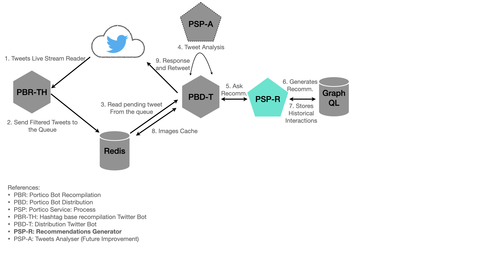

# Portico Recommendation Generator Service (PSP-R)

This is a service that generate scifi recommendations on different topics such as movies, books, or even video games.

## What's the use case?

It uses a NOSQL DB to store all the data needed to generates different random recommendations messages to be used on any kind of social network on demand.

## Architecture



### Building the Image

Use `docker build` command:

```bash
docker build --build-arg SHA1VER=`git rev-parse HEAD` -t porticolabs/psp-r .
```

## Running the bot

Use the image locally built (or pull it from the [public repo](https://hub.docker.com/r/porticolabs/psp-r)) to get the pod running.

To do it on your local machine you can use the following command:

```bash
docker run --rm --name psp-r \
-e PB_DB_HOST=https://XXD \
porticolabs/psp-r
```

## Developing on local

If you're working on some changes to the app, you can run the code on your local with this docker command: 

```bash
docker run --rm --name psp-r -it \
-v `pwd`:/go/src \
--workdir /go/src \
-e PB_DB_HOST=https://XXD \
python:3.7-alpine3.12 sh
```

Then, in the container use `go run` to test your code:

```bash
pip install -r requirements.txt
```

## Environment Variables

The API uses environment variables to configure itself. All variables has default values.

```python
{
    "PB_DB_HOST" : "http://localhost",      # OrientDB Host
    "PB_DB_PORT" : "2480",                  # OrientDB Port
    "PB_DB_USER" : "admin",                 # OrientDB Username
    "PB_DB_PASS" : "admin",                 # OrientDB Password
    "PB_LISTENING_PORT" : "8000"            # UVICORN (Web server) Connection Port
}
```

## Endpoint

The API publishes only one endpoint by now

```http
POST /recommendation
```

The body for this request is

```json
{
    "tweet": {
        "ID":"754839457894237843587",
        "text": "Che @porticocba, que tal algo para leer? #quieroscifi",
        "user":"Lalo_Landa",
        "request": ["movie"]
    }
}
```

Full HTTP Request

```http
POST http://localhost:8000/recommendation HTTP/1.1

{
    "tweet": {
        "ID":"754839457894237843587",
        "text": "Che @porticocba, que tal algo para leer? #quieroscifi",
        "user":"Lalo_Landa",
        "request": ["movie"]
    }
}

```

## Documentation

The server generates the API documentation dinamically, on demand. The documentation is accesible by the URL

```http
http://server/docs 
or 
http://server/redoc
```

>Example: http://localhost:8000/docs
